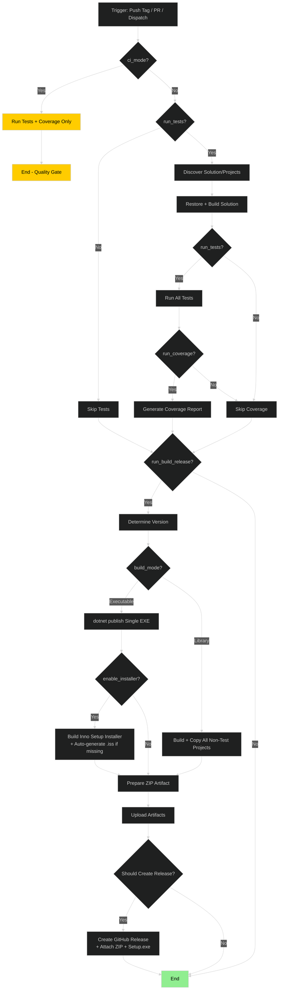

# Shared Workflows for all repos

## Reusable Workflow Flowchart



## Stub 

```yaml
name: CI / Build / Release

on:
  # 1. Every push to any branch → CI only (tests + coverage)
  push:
    branches:
      - '**'
    paths-ignore:
      - '.github/workflows/**'

  # 2. Pull requests into main → full build but no release
  pull_request:
    branches:
      - main

  # 3. Tag push → everything including release
  push:
    tags:
      - 'v*.*.*.*'

  workflow_dispatch:

jobs:
  ci:
    name: CI (Tests + Coverage)
    uses: ScottyMac52/shared-github-workflows/.github/workflows/reusable-build-and-release.yml@main
    if: github.event_name == 'push' && !startsWith(github.ref, 'refs/tags/')
    with:
      dotnet_version: '10.0.x'
      run_tests: true
      run_coverage: true
      run_build_release: false
      ci_mode: true
      create_release: false
    secrets:
      inherit: true

  build-on-main:
    name: Build on PR / Merge to Main
    uses: ScottyMac52/shared-github-workflows/.github/workflows/reusable-build-and-release.yml@main
    if: github.event_name == 'pull_request' || (github.event_name == 'push' && github.ref == 'refs/heads/main')
    with:
      dotnet_version: '10.0.x'
      run_tests: true
      run_coverage: true
      run_build_release: true
      ci_mode: false
      create_release: false          # ← No release on main merges
      enable_installer: false
    secrets:
      inherit: true

  release:
    name: Full Build + Release (Tag only)
    uses: ScottyMac52/shared-github-workflows/.github/workflows/reusable-build-and-release.yml@main
    if: startsWith(github.ref, 'refs/tags/')
    with:
      dotnet_version: '10.0.x'
      run_tests: true
      run_coverage: true
      run_build_release: true
      ci_mode: false
      create_release: true
      enable_installer: false        # Change to true if you want Setup.exe
    secrets:
      inherit: true
```

## Samples

