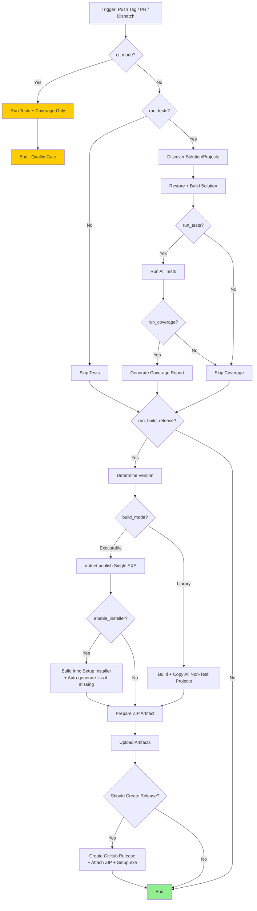

# Shared Workflows for all repos

## Reusable Workflow Flowchart



## Stub 

```yaml
name: Build and Release

on:
  push:
    tags:
      - 'v*.*.*.*'
    paths-ignore:
      - '.github/workflows/**'
  workflow_dispatch:
    inputs:
      dotnet_version:
        description: '.NET version'
        required: false
        default: '10.0.x'
        type: string
      enable_installer:
        description: 'Build Setup.exe installer?'
        required: false
        default: false
        type: boolean
      installer_iss_path:
        description: 'Path to installer.iss'
        required: false
        default: 'installer/installer.iss'
        type: string
      app_publisher:
        description: 'Publisher name'
        required: false
        default: 'Vyper Industries'
        type: string
      skip_projects:
        description: 'Projects to skip (comma-separated)'
        required: false
        default: 'LuaParser'
        type: string
      create_release:
        description: 'Create GitHub Release?'
        required: false
        default: false
        type: boolean

jobs:
  call-reusable:
    name: Build via Shared Workflow
    uses: ScottyMac52/shared-github-workflows/.github/workflows/reusable-build-and-release.yml@main
    with:
      dotnet_version: ${{ inputs.dotnet_version }}
      enable_installer: ${{ inputs.enable_installer }}
      installer_iss_path: ${{ inputs.installer_iss_path }}
      app_publisher: ${{ inputs.app_publisher }}
      skip_projects: ${{ inputs.skip_projects }}
      create_release: ${{ inputs.create_release }}
    secrets:
      inherit: true
```

## Samples

