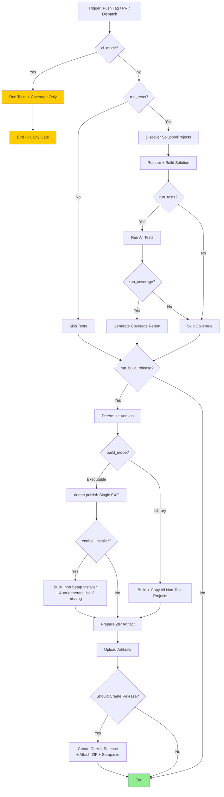

# Shared Workflows for all repos

## Reusable Workflow Flowchart



## Stub 

```yaml
name: Build and Release

on:
  push:
    branches: [ main ]
    tags:
      - 'v*.*.*.*'
    paths-ignore:
      - '.github/workflows/**'
  pull_request:          # Optional: for PR quality gates
    branches: [ main ]
  workflow_dispatch:
    inputs:
      dotnet_version:
        description: '.NET version'
        required: false
        default: '10.0.x'
        type: string
      enable_installer:
        description: 'Build Setup.exe?'
        required: false
        default: false
        type: boolean
      run_tests:
        description: 'Run unit tests?'
        required: false
        default: true
        type: boolean
      run_coverage:
        description: 'Run code coverage?'
        required: false
        default: true
        type: boolean
      run_build_release:
        description: 'Build + create release artifacts?'
        required: false
        default: true
        type: boolean
      ci_mode:
        description: 'CI-only mode (tests + coverage only, no build/release)'
        required: false
        default: false
        type: boolean
      # other inputs...

jobs:
  call-reusable:
    uses: ScottyMac52/shared-github-workflows/.github/workflows/reusable-build-and-release.yml@main
    with:
      dotnet_version: ${{ inputs.dotnet_version || '10.0.x' }}
      enable_installer: ${{ inputs.enable_installer || false }}
      run_tests: ${{ inputs.run_tests || true }}
      run_coverage: ${{ inputs.run_coverage || true }}
      run_build_release: ${{ inputs.run_build_release || true }}
      ci_mode: ${{ inputs.ci_mode || false }}
      # ... other inputs
    secrets:
      inherit: true
```

## Samples

