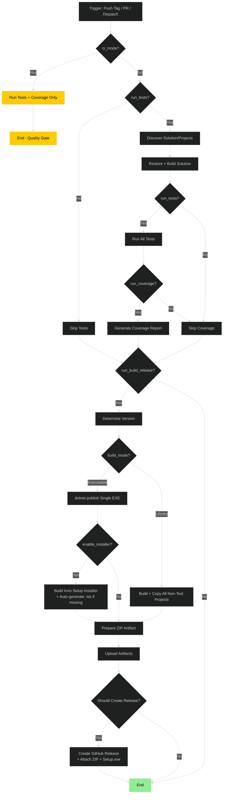

# Shared Workflows for all repos

## Reusable Workflow Flowchart


```mermaid
%%{init: {'theme': 'dark'}}%%
flowchart TD
    A[Trigger: Push Tag / PR / Dispatch] --> B{ci_mode?}
    B -->|Yes| C[Run Tests + Coverage Only]
    B -->|No| D{run_tests?}
    D -->|No| E[Skip Tests]
    D -->|Yes| F[Discover Solution/Projects]
    F --> G[Restore + Build Solution]
    G --> H{run_tests?}
    H -->|Yes| I[Run All Tests]
    I --> J{run_coverage?}
    J -->|Yes| K[Generate Coverage Report]
    J -->|No| L[Skip Coverage]
    H -->|No| L
    C --> M[End - Quality Gate]
    K --> N{run_build_release?}
    L --> N
    E --> N
    N -->|Yes| O[Determine Version]
    N -->|No| Y[End]
    O --> P{build_mode?}
    P -->|Executable| Q[dotnet publish Single EXE]
    P -->|Library| R[Build + Copy All Non-Test Projects]
    Q --> S{enable_installer?}
    S -->|Yes| T[Build Inno Setup Installer\n+ Auto-generate .iss if missing]
    S -->|No| U[Prepare ZIP Artifact]
    R --> U
    T --> U
    U --> V[Upload Artifacts]
    V --> W{Should Create Release?}
    W -->|Yes| X[Create GitHub Release\n+ Attach ZIP + Setup.exe]
    W -->|No| Y[End]
    X --> Y
    style C fill:#ffcc00,color:#000
    style M fill:#ffcc00,color:#000
    style Y fill:#90EE90,color:#000
```

## Stub 

```yaml
name: CI / Build / Release

on:
  # 1. Every push to any branch → CI only (tests + coverage)
  push:
    branches:
      - '**'
    paths-ignore:
      - '.github/workflows/**'

  # 2. Pull requests into main → full build but no release
  pull_request:
    branches:
      - main

  # 3. Tag push → everything including release
  push:
    tags:
      - 'v*.*.*.*'

  workflow_dispatch:

jobs:
  ci:
    name: CI (Tests + Coverage)
    uses: ScottyMac52/shared-github-workflows/.github/workflows/reusable-build-and-release.yml@main
    if: github.event_name == 'push' && !startsWith(github.ref, 'refs/tags/')
    with:
      dotnet_version: '10.0.x'
      run_tests: true
      run_coverage: true
      run_build_release: false
      ci_mode: true
      create_release: false
    secrets:
      inherit: true

  build-on-main:
    name: Build on PR / Merge to Main
    uses: ScottyMac52/shared-github-workflows/.github/workflows/reusable-build-and-release.yml@main
    if: github.event_name == 'pull_request' || (github.event_name == 'push' && github.ref == 'refs/heads/main')
    with:
      dotnet_version: '10.0.x'
      run_tests: true
      run_coverage: true
      run_build_release: true
      ci_mode: false
      create_release: false          # ← No release on main merges
      enable_installer: false
    secrets:
      inherit: true

  release:
    name: Full Build + Release (Tag only)
    uses: ScottyMac52/shared-github-workflows/.github/workflows/reusable-build-and-release.yml@main
    if: startsWith(github.ref, 'refs/tags/')
    with:
      dotnet_version: '10.0.x'
      run_tests: true
      run_coverage: true
      run_build_release: true
      ci_mode: false
      create_release: true
      enable_installer: false        # Change to true if you want Setup.exe
    secrets:
      inherit: true
```

## Samples


## Reusable .NET CI

Use `.github/workflows/reusable-dotnet-ci.yml` when a repository needs explicit project selection instead of solution discovery. The workflow supports .NET 10, formatting verification, a Linux test build, an optional Windows presentation build, and independent per-assembly coverage gates.

Coverage is evaluated with Coverlet's `minimum` statistic. `line_threshold` and `branch_threshold` are separate inputs, so an assembly must satisfy both gates independently; aggregate coverage cannot hide an under-tested layer.

Every test run collects both Cobertura and OpenCover XML plus TRX test results.
The `coverage` Actions artifact contains `dotnet-coverage/coverage.cobertura.xml`,
`dotnet-coverage/coverage.opencover.xml`, and `dotnet-test-results/**/*.trx`.
Upload runs even when tests or coverage gates fail, preserving available diagnostics.
OpenCover includes method complexity and coverage for CRAP analysis; TRX supplies
test outcomes, durations, and failure details. Callers can download this artifact in
a dependent job with `if: always()` to publish HTML reports and a run summary.
Failures before the test runner starts cannot produce coverage or test results.

```yaml
jobs:
  dotnet:
    uses: ScottyMac52/shared-github-workflows/.github/workflows/reusable-dotnet-ci.yml@main
    with:
      dotnet_version: 10.0.x
      test_project: tests/Example.Tests/Example.Tests.csproj
      presentation_project: src/Example.App/Example.App.csproj
      coverage_include: '[Example.Domain]*%2c[Example.Application]*'
      line_threshold: 80
      branch_threshold: 80
```
